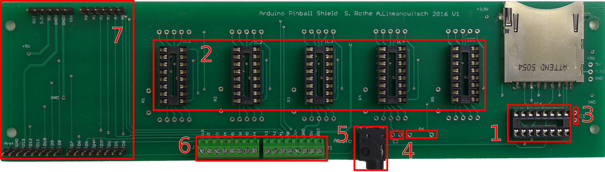

# Mikrocontroller-Modul für Flipperautomaten 2016

## Einleitung

Durch das Mikrocontroller-Modul kann der Flipperautomat mit folgenden Funktionen erweitert werden:

- Sound: Abspielen von Audiodateien
- Display: Anzeige von Punktestand und Lauftext sowie weiteren Informationen
- Spiellogik: Zählen von Punkten, Spielende nach definierbarer Anzahl Bällen, permanente Speicherung des Punkterekords (*Highscore*)

Das Abspielen von Audiodateien und die Aktionen der Spiellogik werden durch das Schliessen von Kontakten ausgelöst. Die konkreten Aktionen können für jeden Kontakt ohne Programmierkenntnisse konfiguriert werden.

Audio- und Konfigurationsdateien sowie der Punkterekord werden auf einer SD-Karte gespeichert.

## Komponenten

### Basis

| Komponente            | Einzelpreis | Anzahl | Total |
|:--------------------- |:----------- |:------ |:----- |
| Puffer-Treiber        |  0.40       | 1      |  0.40 |
| IC-Fassung 16 Pol     |  0.30       | 1      |  0.30 |
| Schraubklemmblock     |  1.10       | 2      |  2.20 |
| Stiftleisten 1x6-Pol  |  0.30       | 2      |  0.60 |
| Stiftleisten 1x8-Pol  |  0.30       | 2      |  0.60 |
| Kondensator 0.1 µF    |  0.25       | 1      |  0.25 |
| SD-Kartensockel       |  3.00       | 1      |  3.00 |
| SD-Karte              |  8.95       | 1      |  8.95 |
| Arduino               | 20.00       | 1      | 20.00 |
| Platine               |  5.00       | 1      |  5.00 |
| USB-Ladegerät         |  9.95       | 1      |  9.95 |
| USB-Kabel 50 cm       |  1.95       | 1      |  1.95 |
| Verbrauchsmaterial    |  2.60       |        |  2.60 |
| **Total**             |             |        | **55.80** |

### Siebensegmentanzeige

| Komponente            | Einzelpreis | Anzahl | Total |
|:--------------------- |:----------- |:------ |:----- |
| Siebensegmentanzeige  |  2.90       | 5      | 14.50 |
| Schieberegister       |  0.50       | 5      |  2.50 |
| IC-Fassung 16 Pol     |  0.30       | 5      |  1.50 |
| **Total**             |             |        | **18.50** |

### Audioausgabe

| Komponente            | Einzelpreis | Anzahl | Total |
|:--------------------- |:----------- |:------ |:----- |
| Klinkensteckverbinder |  1.25       | 1      |  1.25 |
| Kondensator 1 nF      |  0.25       | 1      |  0.25 |
| Widerstand 470 Ohm    |             | 1      |       |
| Lautsprecherboxen     | 13.95       | 1      | 13.95 |
| **Total**             |             |        | **15.45** |

### Steuerung

| Komponente            | Einzelpreis | Anzahl | Total |
|:--------------------- |:----------- |:------ |:----- |
| Relais                | 1.20        |        |       |
| Transistor            | 0.45        |        |       |

### Verwendete Komponenten

- Siebensegmentanzeige: [Kingbright SC10-21HWA](http://www.conrad.ch/ce/de/product/160040/)
- Klinkensteckverbinder 3.5mm: [BKL Electronic 1109050](http://www.conrad.ch/ce/de/product/730294/)
- Schieberegister: [Texas Instruments SN74HC595N PDIP-16](http://www.conrad.ch/ce/de/product/1016774/)
- Schraubklemmblock: [AKZ692/8-2.54-V-GRÜN](http://www.conrad.ch/ce/de/product/567844/)
- SD-Karte: [2 GB Transcend](https://www.conrad.ch/ce/de/product/992826/)
- SD-Kartensockel: [Attend 104H-TDA0-R01 1](http://www.conrad.ch/ce/de/product/1308325/)
- Puffer-Treiber: [Texas Instruments CD74HC4050E PDIP-16](https://www.conrad.ch/ce/de/product/164895/)
- USB-Ladegerät: [Goobay 42663](http://www.conrad.ch/ce/de/product/393438/)
- Lautsprecherboxen: [Logitech Z120 2.0](http://www.conrad.ch/ce/de/product/917126/)
- Kondensator 1 nF: [Keramik-Kondensator 1 nF](http://www.conrad.ch/ce/de/product/1420284/)
- Kondensator 0.1 µF: [Keramik-Kondensator 0.1 µF](http://www.conrad.ch/ce/de/product/458211/)
- Relais: [Maluska DIL Miniaturrelais HJR-4102 (E)](http://www.conrad.ch/ce/de/product/629493/)
- Transistor: [STMicroelectronics TIP120 Darlington](http://www.conrad.ch/ce/de/product/150872/)

## Zusammenbau

Beim Zusammenbau ist es sehr wichtig, auf die korrekte Reihenfolge zu achten. Zuerst werden die Komponenten auf der Rückseite der Platine wie folgt gelötet:



1. IC-Sockel für Puffer-Treiber löten
2. *nur mit Siebensegmentanzeige:* IC-Sockel für Anzeige löten
3. Kondensator 0.1 µF löten
4. *nur mit Audioausgabe:* Widerstand 470 Ohm und Kondensator 1 nF löten
5. *nur mit Audioausgabe:* Klinkensteckverbinder löten
6. Schraubklemmblöcke löten
7. Stiftleisten Arduino löten

Anschliessend werden die Siebensegmentanzeigen auf der Vorderseite der Platine angelötet.

## Anschlüsse

Das Modul stellt mit den grünen Schraubklemmblöcken 16 Anschlüsse zu Verfügung, mit welchen das Modul mit dem Automaten verbunden werden kann. Die folgende Tabelle zeigt die Anschlüsse:

| Nr. | Bezeichnung | Arduino | Bedeutung                       |
|:--- |:----------- |:------- |:------------------------------- |
|  1  | PWM         | D10     | Audioausgabe                    |
|  2  | IO-A        | D2      | Digitale Ein-/Ausgang A         |
|  3  | IO-B        | D3      | Digitale Ein-/Ausgang B         |
|  4  | IO-C        | D4      | Digitale Ein-/Ausgang C         |
|  5  | IO-D        | D5      | Digitale Ein-/Ausgang D         |
|  6  | IO-E        | D6      | Digitale Ein-/Ausgang E         |
|  7  | IO-F        | A5      | Digitale Ein-/Ausgang F         |
|  8  | IO-G        | A4      | Digitale Ein-/Ausgang G         |
|  9  | IO-H        | A3      | Digitale Ein-/Ausgang H         |
| 10  | IO-I        | A2      | Digitale Ein-/Ausgang I         |
| 11  | IO-J        | A1      | Digitale Ein-/Ausgang J         |
| 12  | IO-K        | A0      | Digitale Ein-/Ausgang K         |
| 13  | VIN         | VIN     | Speisespannung (nicht benutzen) |
| 14  | GND         | GND     | Masse (0 Volt)                  |
| 15  | 5V          | 5V      | 5 Volt                          |
| 16  | RESET       | RESET   | Anschluss für Reset-Taste       |

## Inbetriebnahme

Das Modul wird in Betrieb genommen, indem es über den USB-Anschluss mit einer 5 Volt-Spannungsquelle verbunden wird. Das Verhalten beim Einschalten hängt wesentlich von der SD-Karte ab. Ist keine Karte im Sockel vorhanden, so wird erst eine Sekunde lang der Text `HELLO`, dann drei Sekunden lang die Softwareversion, beispielsweise `r 01`, angezeigt. Anschliessend fordert ein Text zum Einlegen einer SD-Karte auf.

Ist auf der eingelegten SD-Karte die Datei `test.wav` vorhanden, so wird der Testmodus aktiviert. In diesem Modus kann die Funktionstüchtigkeit der Hardware überprüft werden:

- Die Datei `test.wav` abgespielt.
- Die Zahl `88888` wird drei Sekunden lang angezeigt.
- Anschliessend wird auf der Anzeigt der zuletzt aktivierte Pin angezeigt, beispielweise `IO-A`.

## Programmierung

Das Modul kann programmiert werden, indem Befehle definiert werden, welche beim Auftreten eines bestimmten
Ereignisses ausgeführt werden sollen. Beispiele für Ereignisse sind:

- Der Anschluss IO-A ist aktiviert worden.
- Ein neuer Punkterekord ist erreicht worden.
- Ein interner Countdown ist abglaufen.

Beispiele für Befehle sind:

- Erhöhe den Punktestand um 5.
- Starte einen internen Countdown von 5000 Millisekunden.

Die Programmierung findet über die Datei `p.txt` auf der SD-Karte statt.

```
@a s+1000 m:3 t:2000

@t m>0 m-1 m=0 b:1
```
### Ereignisse

Ein Ereignis wird durch das `@`-Zeichen, gefolgt von einem kleinen Buchstaben gekennzeichnet.
Die folgende Tabelle gibt einen Überblick über alle möglichen Ereignisse:

| Name | ID | Beschreibung                                                   |
|:---- |:-- |:-------------------------------------------------------------- |
| `@a` |  0 | Anschluss IO-A ist aktiviert worden                            |
| `@c` |  2 | Anschluss IO-C ist aktiviert worden                            |
| `@b` |  1 | Anschluss IO-B ist aktiviert worden                            |
| `@d` |  3 | Anschluss IO-D ist aktiviert worden                            |
| `@e` |  4 | Anschluss IO-E ist aktiviert worden                            |
| `@f` |  5 | Anschluss IO-F ist aktiviert worden                            |
| `@g` |  6 | Anschluss IO-G ist aktiviert worden                            |
| `@h` |  7 | Anschluss IO-H ist aktiviert worden                            |
| `@i` |  8 | Anschluss IO-I ist aktiviert worden                            |
| `@j` |  9 | Anschluss IO-J ist aktiviert worden                            |
| `@k` | 10 | Anschluss IO-K ist aktiviert worden                            |
| `@l` | 11 | Countdown l hat Null erreicht                                  |
| `@m` | 12 | Countdown m hat Null erreicht                                  |
| `@n` | 13 | Countdown n hat Null erreicht                                  |
| `@o` | 14 | Countdown o hat Null erreicht                                  |
| `@p` | 15 | Countdown p hat Null erreicht                                  |
| `@q` | 16 | Countdown q hat Null erreicht                                  |
| `@r` | 18 | Der Mikrocontroller ist zurückgesetzt worden (*reset*)         |
| `@s` | 12 | Ein neuer Punkterekord ist erreicht worden (*high score*)      |
| `@t` | 17 | Der letzte Ball ist verloren gegangen (*game over*)            |

### Ein- und Ausgabe

Ein Anschluss kann nur entweder für die Ein- oder für die Ausgabe verwendet werden. Wenn in der Datei `p.txt` eines der Ereignisse `@a` bis `@k` vorkommt, so wird der entsprechenden Anschluss für die Eingabe konfiguriert. Ansonsten wird der Anschluss für die Ausgabe vorgesehen.

### Befehle

Ein Befehl besteht aus drei Teilen: einer *Variablen*, einem *Operationszeichen* und einer *Zahl*. Beispiele für Befehle sind:

`x>20`, `s+1000`, `a:1`

Zwischen den einzelnen Teilen eines Befehls dürfen keine Leerzeichen vorkommen.

### Variablen

Alle Kleinbuchstaben von `a` bis `z` sind Variablen.

Die Variablen `a` bis `k` repräsentieren die entsprechenden Pins *IO-A* bis *IO-K*. Sie enthalten den Wert `1`, falls der Pin aktiviert ist, ansonsten den Wert `0`. Indem die Variable auf `1` oder `0` gesetzt wird, kann die Ausgabespannung des Pins auf 5 Volt bzw. 0 Volt geändert werden.

Die Variablen `u` bis `z` sind frei benutzbar. Sie können Werte zwischen `0` und `65535` annehmen. Die Variablen `l` bis `q` sind Zählvariablen. Dass heisst, ihr Wert wird im Schnitt jede Millisekunde um eins vermindert. Erreicht eine Zählvariable den Wert Null, so wird das entsprechende Ereignis ausgelöst. Wird beispielsweise die Variable `m` auf 5000 gesetzt, so erreicht sie nach fünf Sekunde den Wert Null und löst das Ereignis `@m` aus.

In der Variable `s` ist der aktuelle Punktestand gespeichert, in der Variable `t` die aktuelle Anzahl Bälle.

| Name | ID | Beschreibung             | Maximaler Wert |
|:---- |:-- |:------------------------ |:-------------- |
| `a`  |  0 | Anschluss IO-A           |              1 |
| `b`  |  1 | Anschluss IO-B           |              1 |
| `c`  |  2 | Anschluss IO-C           |              1 |
| `d`  |  3 | Anschluss IO-D           |              1 |
| `e`  |  4 | Anschluss IO-E           |              1 |
| `f`  |  5 | Anschluss IO-F           |              1 |
| `g`  |  6 | Anschluss IO-G           |              1 |
| `h`  |  7 | Anschluss IO-H           |              1 |
| `i`  |  8 | Anschluss IO-I           |              1 |
| `j`  |  9 | Anschluss IO-J           |              1 |
| `k`  | 10 | Anschluss IO-K           |              1 |
| `l`  | 11 | Countdown                |          65535 |
| `m`  | 12 | Countdown                |          65535 |
| `n`  | 13 | Countdown                |          65535 |
| `o`  | 14 | Countdown                |          65535 |
| `p`  | 15 | Countdown                |          65535 |
| `q`  | 16 | Countdown                |          65535 |
| `r`  | 17 | nicht verfügbar          |                |
| `s`  | 18 | aktueller Punktestand    |          99999 |
| `t`  | 19 | Anzahl Bälle             |            255 |
| `u`  | 20 | Variable                 |          65535 |
| `v`  | 21 | Variable                 |          65535 |
| `w`  | 22 | Variable                 |          65535 |
| `x`  | 23 | Variable                 |          65535 |
| `y`  | 24 | Variable                 |          65535 |
| `z`  | 25 | Variable                 |          65535 |

### Operationszeichen

Es gibt sechs Operationszeichen, die in der folgenden Tabelle beschrieben werden:

| Name | Beschreibung                                                             |
|:---- |:------------------------------------------------------------------------ |
| `:`  | Setze die Variable auf die Zahl                                          |
| `+`  | Erhöhe die Variable um die Zahl                                          |
| `-`  | Subtrahiere die Zahl von der Variable                                    |
| `>`  | Nächste Aktion nur, wenn der Wert der Variable grösser als die Zahl ist  |
| `=`  | Nächste Aktion nur, wenn der Wert der Variable gleich die Zahl ist       |
| `<`  | Nächste Aktion nur, wenn der Wert der Variable kleiner als die Zahl ist  |

### Zahlen

Zahlen in einem Befehl bestehen ausschliesslich aus den Ziffern `0` bis `9`. Negative Zahlen sind nicht erlaubt. Die erste Ziffer darf keine `0` sein, ausgenommen bei der Zahl `0`. Die Zahl muss kleiner als 100000 sein.

## Grundfunktionalität

Die folgenden grundlegenden Funktionen sind fest vorgegeben:

- Grundsätzlich wird der aktuelle Punktestand angezeigt.
- Wird die Anzahl Bälle verändert, wird eine Sekunde lang die neue Anzahl Bälle angezeigt.
- Ist die neue Anzahl Bälle gleich Null, so wird *GAME OVER* abwechselnd mit dem Punktestand angezeigt. Danach kann der Punktestand nicht mehr verändert werden, erst nach einem Reset kann ein neues Spiel gestartet werden.

### Punkterekord

Der Punkterekord (*high score*) ist auf der SD-Karte in der Datei `s.txt` gespeichert. Bei der Initialisierung des Mikrocontrollers wird der letzte Rekord aus der Datei gelesen und angezeigt. Wenn der Spieler eine höhere Punktzahl erreicht, wird kurz *HISCR* angezeigt und der neue Rekord gespeichert. Ab diesem Zeitpunkt wird der neue Rekord regelmässig auf der SD-Karte gespeichert.

## Konfiguration von Audioeffekten

### Dateiformat

Das Steuerungsmodul kann nur PCM-Audiodaten (*Puls-Code-Modulation*) abspielen. Die Dateien müssen im WAV-Dateiformat (*Waveform Audio File Format*) mit einem Kanal (Mono), einer Bit-Tiefe von 8 und einer Abtastfrequenz von 16000 Hz vorliegen.

Mit dem frei verfügbaren Programm Audacity kann jede Audiodatei mit kleinem Aufwand in das geeignete Format umgewandelt werden:

1. Audiodatei öffnen.
2. Spur auswählen.
3. Menüpunkt Spuren / Stereosput in Mono umwandeln auswählen.
4. Projektfrequenz auf 16000 Hz stellen (unten links).
5. Exportieren als *Andere unkomprimierte Dateien* mit den folgenden Optionen:

    - Header: WAV (Microsoft)
    - Codec: Unsigned 8 bit PCM

### Dateiname

Der Dateiname muss mit dem Namen eines *Ereignisses* übereinstimmen. Die Dateiendung muss `.wav` lauten. Der ganze Dateiname muss in Kleinbuchstaben geschrieben werden.

## Anwendungsbeispiele

### Spielfeld mit drei Targets

Auf einem Spielfeld sind drei Targets vorhanden. Das erste Target hat einen Wert von 50 Punkten, das zweite 100 Punkte und für einen Treffer des dritten Targets erhält man 1000 Punkte. Bei einem Treffer des dritten Targets soll ausserdem ein Audioeffekt ausgegeben werden.

**Verdrahtung:** Vom Masse-Ausgang des Ausgabemoduls (*GND*) wird ein Kabel zum einen Kontakt des ersten Targets gezogen. Anschliessend wird von diesem Kontakt in Kabel weiter zum einen Kontakt des zweiten und schliesslich zur dritten Target weitergezogen. Nun ist der eine Kontakt jedes Targets mit der Masse des Ausgabemoduls verbunden. Nun wird der andere Kontakt des ersten Targets mit dem Eingang *IO-A* des Moduls verbunden, anschliessend der andere Kontakt des zweiten Targets mit dem Eingang *IO-B* und schliesslich der andere Kontakt des dritten Targets mit dem Eingang *IO-C*.


Wenn nun ein Target getroffen wird, so wird der Stromkreis geschlossen und am entsprechenden
Eingang liegt eine Spannung von 0 Volt an und das Ausgabemodul erkennt den Eingang als "aktiv".

**Programmierung:** In der Programmdatei `p.txt` wird die zu zählende Punktzahl pro Eingang festgelegt:

```
@a s+50
@b s+100
@c s+1000
```

Um den einen Audioeffekt abzuspielen, muss ausserdem die gewünschte Audiodatei in das korrekte Format konvertiert und untern dem Namen `a.wav` auf der SD-Karte gespeichert werden.

### Varierende Punktzahl

Auf dem Spielfeld ist ein Target vorhanden. Ein Treffer soll 10 Punkte zählen, jeder dritte Treffer jedoch 50 Punkte.

**Verdrahtung:**: Vom Masse-Ausgang des Ausgabemoduls (*GND*) wird ein Kabel zum einen Kontakt des Targets gezogen.
Der andere Kontakt des Targets wird mit dem Eingang *IO-A* verbunden.

**Programmierung:** Die Variable `x` wird verwendet, um die Anzahl Treffer zu zählen. Bei der Aktivierung des Eingangs *IO-A* (Ereignis `@a`) wird der Wert von `x` um eins erhöht. Wenn nun `x` gleich drei ist, wird der Punktestand um 50 erhöht, ansonsten nur um 10. Wenn `x` den Wert drei erreicht, wird `x` wieder auf Null gesetzt.

```
@a x+1 x=3 s+50 x<3 s+10 x=3 x:0
```
Das Programm liest sich so:

| Befehl     | Bedeutung                                                                |
|:---------- |:------------------------------------------------------------------------ |
| `@a`       | Wenn Eingang *IO-A* aktiviert wird, führe die folgenden Anweisungen aus: |
| `x+1`      | Erhöhe den Wert `n` um eins.                                             |
| `x=3 s+50` | Wenn `x` gleich drei ist, erhöhe den Punktestand um 50.                  |
| `x<3 s+10` | Wenn `x` kleiner als drei ist, erhöhe den Punktestand um 10.             |
| `x=3 x:0`  | Wenn `x` gleich drei ist, dann setze `x` auf Null.                       |

### Verzögert Punkte zählen

Auf dem Spielfeld ist ein Target vorhanden. Bei einem Treffer soll der Punktestand langsam innerhalb einer Sekunde um
100 Punkte erhöht werden.

**Verdrahtung:**: Vom Masse-Ausgang des Ausgabemoduls (*GND*) wird ein Kabel zum einen Kontakt des Targets gezogen.
Der andere Kontakt des Targets wird mit dem Eingang *IO-B* verbunden.

**Programmierung:** In der Variable `y` werden die Punkte, die noch addiert werden müssen, gespeichert. Der Zähler
`m` wird auf 10 Millisekunden gesetzt. Wenn die Zeit abgelaufen ist, wird die Punktezahl um eins erhöht und der Wert von
`y` um eins reduziert. Wenn noch zu zählende Punkte übrig sind (`y` grösser als Null), wird der Zähler erneut gestartet.

```
@b y:100 m:10
@m y-1 s+1 y>0 m:10
```

| Befehl     | Bedeutung                                                                |
|:---------- |:------------------------------------------------------------------------ |
| `@b`       | Wenn Eingang *IO-B* aktiviert wird, führe die folgenden Anweisungen aus: |
| `y:100`    | Setze den Wert von `y` auf 100                                           |
| `m:10`     | Setze den Countdown `m` auf 10 Millisekunden                             |
| `@m`       | Wenn der Countdown m Null erreicht, führe die folgenden Anweisungen aus: |
| `y-1`      | Reduziere den Wert von `y` um eins                                       |
| `s+1`      | Erhöhe den Punktestand um eins                                           |
| `y>0 m:10` | Wenn `y` grösser als Null ist, setze den Countdown `m` auf 10 ms         |

### Kugelverlust und Game Over

Bei einem Flipperautomaten soll maximal mit drei Kugeln gespielt werden können. Anschliessend muss ein neues Spiel gestartet werden.

Damit ein Kugelverlust festgestellt werden kann, muss ein Kontakt angebracht werden, der durch jeden möglichen Kugelverlust ausgelöst wird. Um ein neue Spiel zu starten, muss zusätzlich ein Taster am Automaten angebracht werden.

**Verdrahtung:** Der eine Kontakt des Tasters und der Ballverlust-Kontakt wird mit der Masse des Ausgabemodus verbunden. Der andere Kontakt des Ballverlust-Kontakts wird mit einem Eingang, z.B. *IO-A* verbunden. Der andere Kontakt des Tasters wird mit dem *RESET*-Eingang des Moduls verbunden.


**Programmierung:** In der Programmdatei `p.txt` wird festgelegt, dass bei der Aktivierung von Eingang *IO-A* (Ereignis `@a`) die Anzahl Kugeln um eins zu reduzieren ist:

```
@a z-1
```

### Target aktivieren

Bei einem Automaten soll ein Target erst Punkte zählen, wenn es aktiviert worden ist. Dies geschieht, indem erst ein anderes Target (der Aktivator) getroffen wird. Mit einer Leuchtdiode wird dem Spieler angezeigt, ob das Target aktiv ist.

**Verdrahtung:** Der eine Kontakt des Targets wird mit dem Eingang *IO-A* verbunden, der eine Kontakt des Aktivators mit dem Eingang *IO-B*. Die anderen Kontakte der beiden Targets werden mit der Masse verbunden. Die Anode der Leuchtdiode wird mit dem Ausgang *IO-C* verbunden, die Kathode über einen Widerstand mit der Masse. Die Grösse des zu verwendenden Widerstands hängt vom Stromverbrauch der Leuchtdiode ab.


**Programmierung:** Über den Ausgang *IO-C* wird festgelegt, ob das Target aktiv ist. Wird der Ausgang mit dem Befehlt `c:1` aktiviert, dann leuchtet die Leuchtdiode. Mit `c:0` wird der Ausgang deaktiviert.

In der Programmdatei `p.txt` wird also festgelegt, dass bei der Aktivierung von Eingang *IO-A* (Ereignis `@a`) der Zustand des Ausgangs *IO-C* über die Variable `c` jeweils geändert wird. Wenn der Eingang *IO-B* aktiviert wird, wird die Punktezahl nur erhöht, wenn der Ausgang *IO-C* aktiv ist (d.h. die Variable `c` den Wert `1` hat).

```
@a c=1 c:0 c=0 c:1
@b c=1 s+1000
```

### Steuerung von Spulen

Für das Aktivieren einer Spule, welche häufig zur Steuerung von mechanischen Komponenten verwendet werden, ist eine grössere Spannung nötig als die 5 Volt, welche vom Mikrocontroller-Modul geliefert werden. Um mit einer kleinen Spannung eine grössere Spannung zu schalten, wird ein Relais verwendet.

Das verwendete Relais (Maluska DIL Miniaturrelais HJR-4102) hat fünf Pins mit folgender Anordnung:


Das Relais wird geschaltet, indem zwischen Pin 11 und 12 eine Spannung von 5 V angelegt wird. Der Pin 11 muss also mit einem Ausgang (z.B. *IO-A*), der Pin 12 mit der Masse *GND* verbunden werden.

### Zeitschaltung

Bei einem Flipperautomaten soll nach dem Treffen eines Targets ein Tor für zehn Sekunden geöffnet werden. Nach Ablauf der Zeit soll das Tor wieder geschlossen werden.

**Verdrahtung:** Der eine Kontakt des Targets wird mit dem Eingang *IO-A* verbunden, der andere Kontakt mit der Masse. Der Pin 11 des Relais wird mit Dem Ausgang *IO-B* verbunden, der Pin 12 mit der Masse. Die anderen Pins des Relais werden für die Steuerung eines separaten Stromkreises verwendet und dürfen auf keinen Fall mit den Ein-/Ausgängen des Mikrocontroller-Moduls verbunden werden!

**Programmierung:** In der Programmdatei `p.txt` wird also festgelegt, dass bei der Aktivierung von Eingang *IO-A* (Ereignis `@a`) der Ausgang *IO-B* (Variable `b`) aktiviert wird. Ausserdem wird der Countdown `m` auf 10 Sekunden (10000 Millisekunden) gesetzt. Nach Ablauf dieser Zeit (Ereignis `@m`) wird der Ausgang *IO-B* wieder deaktiviert.

```
@a b:1 m:10000
@m b:0
```


### Anschluss einer Nixie-Anzeige

Anstelle der Siebensegmentanzeige kann die Nixie-Anzeige *QS30-1/SZ-8 Nixie Uhr* verwendet werden, um den Punktestand anzuzeigen.

Die Nixie-Anzeige wird grundsätzlich auf die gleiche Weise wie die Siebensegmentanzeige angesteuert. Am einfachsten wird die Anzeige an den für den Chip IC1 vorgesehenen Pinholes der Platine angeschlossen. Sie kann aber auch direkt mit
dem Arduino verbunden werden. Die untenstehende Tabelle zeigt, wie die Pins verbunden werden müssen:

| Pin Nixie | Pin Arduino | Pin IC1 |
|:--------- |:----------- |:------- |
| DIN       | 8           | 14      |
| STCP      | 7           | 12      |
| SHCP      | 9           | 11      |

Um das Modul mit einer Nixie-Anzeige zu betreiben, muss das Arduino-Programm mit dem zusätzlichen Define `NIXIE` compiliert werden.

### Steuerung eines RGB-LED-Streifens

Mit dem Mikrocontroller-Modul kann ein farbiger LED-Streifen angesteuert werden. Es können handelsübliche LED-Streifen verwendet werden. Ein RGB-LED-Streifen weist üblicherweise vier Anschlüsse auf: Ein gemeinsamer Anschluss für alle Anoden, sowie je ein Anschluss für die Kathoden der roten, grünen und blauen Leuchtdioden.

Der gemeinsame Anschluss wird mit dem positiven Pol der mitgelieferten Spannungsversorgung verbunden. Die Kathodenanschlüsse werden über je ein Relais mit entweder dem positiven oder dem negativen Pol des Spannungsversorgung
verbunden. Dabei muss der Ruhekontakt des Relais (Pin 1) mit dem positiven under der Aktivkontakt (Pin 2) mit dem negativen Pol verbunden werden.

Die Relais werden gemäss dem Kapitel "Steuerung von Spulen" angeschlossen und gesteuert.


### Sondermodus doppelte Punktzahl mit LED-Streifen

Auf einem Automaten mit RGB-LED-Streifen soll ein spezielles Target einen Sondermodus aktivieren. Während der Sondermodus aktiv ist, zählen alle Targets doppelt. Der Sondermodus wird optisch durch ein regelmässiges Wechseln der Farbe der Leuchtdioden signalisiert. Nach 20 Sekunden wird der Sondermodus beendet.

**Verdrahtung:** Der LED-Streifen wird an den Eingängen *IO-A*, *IO-B* und *IO-C* angeschlossen. Das spezielle Target am
Eingang *IO-D*. Exemplarisch für die Punkte zählenden Targets wird der Anschluss *IO-E* verwendet.

**Programmierung:** Für den Sondermodus wird der Timer `@m` verwendet. Die Variable `u` zeigt an, ob Punkte doppelt gezählt werden sollen, die Variable `v` wird verwendet, um den aktuellen Farbschritt zu speichern: 0 entspricht rot, 1 entspricht grün, 2 entspricht blau. Im folgenden wird das Programm zeilenweise erläutert:

```
@d m:1 n:20000 u:1
```

Wird das spezielle Target aktiviert (`@d`), dann wird der Timer `m` auf eins gesetzt, um möglichst bald das Ereignis `@m` auszulösen. Der Timer `n` wird auf 20 Sekunden gesetzt, um das Ende des Sondermodus erkennen zu können. Die Variable `u` wird auf 1 gesetzt, um das doppelte Zählen der Punkte einzuschalten.

```
@m a:0 b:0 c:0 v=0 a:1 v=1 b:1 v=2 c:1 v+1 v=3 v:0 m:500
```

Das Ablaufen des Timers `m` signalisiert, dass die Farbe gewechselt werden muss. Dazu werden erst alle drei Farben ausgeschaltet, danach je nach Wert von `v` eine der drei Farben wieder eingeschaltet. Anschliessend wird `v` um eins erhöht. Wenn `v` zu hoch ist, wird die Variable wieder auf 0 gesetzt. Zuletzt wird der Timer `m` neu gestartet. Hier wird die Frequenz des Farbwechsels festgelegt.

```
@n m:0 a:0 b:0 c:0 u:0
```

Das Ereignis `@n` signalisiert, dass der Sondermodus zu Ende ist. Der Timer `m` wird auf 0 gesetzt, um einen weiteren Aufruf des Ereignisses `@m` zu verhindern. Alle drei Farben werden ausgeschaltet. Die Variable `u` wird wieder auf 0 gesetzt, um das doppelte Zählen der Punkte auszuschalten.

```
@e s+100 u=1 s+100
```

Beim Ereignis `@e` wird der Punktestand um 100 erhöht. Falls der Sondermodus aktiv ist (d.h. wenn die Variable `u` den Wert 1 hat), wird die Punktestand nochmals erhöht.

Das vollständige Programm sieht so aus:

```
@d m:1 n:20000 u:1
@m a:0 b:0 c:0 v=0 a:1 v=1 b:1 v=2 c:1 v+1 v=3 v:0 m:500
@n m:0 a:0 b:0 c:0 u:0
@e s+100 u=1 s+100
```
