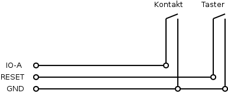

# Mikrocontroller-Modul für Flipperautomaten 2016

## Einleitung

Durch das Mikrocontroller-Modul kann der Flipperautomat mit folgenden Funktionen erweitert werden:

- Sound: Abspielen von Audiodateien
- Display: Anzeige von Punktestand und Lauftext sowie weiteren Informationen
- Spiellogik: Zählen von Punkten, Spielende nach definierbarer Anzahl Bällen, permanente Speicherung des Punkterekords (*Highscore*)

Das Abspielen von Audiodateien und die Aktionen der Spiellogik werden durch das Schliessen von Kontakten ausgelöst. Die konkreten Aktionen können für jeden Kontakt ohne Programmierkenntnisse konfiguriert werden.

Audio- und Konfigurationsdateien sowie der Punkterekord werden auf einer SD-Karte gespeichert.

## Komponenten

### Basis

| Komponente            | Einzelpreis | Anzahl | Total |
| --------------------- | ----------- | ------ | ----- |
| Puffer-Treiber        |  0.40       | 1      |  0.40 |
| IC-Fassung 16 Pol     |  0.30       | 1      |  0.30 |
| Schraubklemmblock     |  1.10       | 2      |  2.20 |
| Stiftleisten 1x6-Pol  |  0.30       | 2      |  0.60 |
| Stiftleisten 1x8-Pol  |  0.30       | 2      |  0.60 |
| Kondensator 0.1 µF    |  0.25       | 1      |  0.25 |
| SD-Kartensockel       |  3.00       | 1      |  3.00 |
| SD-Karte              |  8.95       | 1      |  8.95 |
| Arduino               | 20.00       | 1      | 20.00 |
| Platine               |  5.00       | 1      |  5.00 |
| USB-Ladegerät         |  9.95       | 1      |  9.95 |
| Verbrauchsmaterial    |  2.60       |        |  2.60 |
| **Total**             |             |        | **51.25** |

### Siebensegmentanzeige

| Komponente            | Einzelpreis | Anzahl | Total |
| --------------------- | ----------- | ------ | ----- |
| Siebensegmentanzeige  |  2.90       | 5      | 14.50 |
| Schieberegister       |  0.50       | 5      |  2.50 |
| IC-Fassung 16 Pol     |  0.30       | 5      |  1.50 |
| **Total**             |             |        | **18.50** |

### Audioausgabe

| Komponente            | Einzelpreis | Anzahl | Total |
| --------------------- | ----------- | ------ | ----- |
| Klinkensteckverbinder |  1.25       | 1      |  1.25 |
| Kondensator 1 nF      |  0.25       | 1      |  0.25 |
| Widerstand 470 Ohm    |             | 1      |       |
| Lautsprecherboxen     | 13.95       | 1      | 13.95 |
| **Total**             |             |        | **15.45** |

### Verwendete Komponenten

- Siebensegmentanzeige: [Kingbright SC10-21HWA](http://www.conrad.ch/ce/de/product/160040/)
- Klinkensteckverbinder 3.5mm: [BKL Electronic 1109050](http://www.conrad.ch/ce/de/product/730294/)
- Schieberegister: [Texas Instruments SN74HC595N PDIP-16](http://www.conrad.ch/ce/de/product/1016774/)
- Schraubklemmblock: [AKZ692/8-2.54-V-GRÜN](http://www.conrad.ch/ce/de/product/567844/)
- SD-Karte: [2 GB Transcend](https://www.conrad.ch/ce/de/product/992826/)
- SD-Kartensockel: [Attend 104H-TDA0-R01 1](http://www.conrad.ch/ce/de/product/1308325/)
- Puffer-Treiber: [Texas Instruments CD74HC4050E PDIP-16](https://www.conrad.ch/ce/de/product/164895/)
- USB-Ladegerät: [Goobay 42663](http://www.conrad.ch/ce/de/product/393438/)
- Lautsprecherboxen: [Logitech Z120 2.0](http://www.conrad.ch/ce/de/product/917126/)
- Kondensator 1 nF: [Keramik-Kondensator 1 nF](http://www.conrad.ch/ce/de/product/1420284/)
- Kondensator 0.1 µF: [Keramik-Kondensator 0.1 µF](http://www.conrad.ch/ce/de/product/458211)

## Zusammenbau

Beim Zusammenbau ist es sehr wichtig, auf die korrekte Reihenfolge zu achten. Zuerst werden die Komponenten auf der Rückseite der Platine wie folgt gelötet:

{ width=100% }

1. IC-Sockel für Puffer-Treiber löten
2. *nur mit Siebensegmentanzeige:* IC-Sockel für Anzeige löten ()
3. Kondensator 0.1 µF löten
4. *nur mit Audioausgabe:* Widerstand 470 Ohm und Kondensator 1 nF löten ()
5. *nur mit Audioausgabe:* Klinkensteckverbinder löten
6. Schraubklemmblöcke löten
7. Stiftleisten Arduino löten

Anschliessend werden die Siebensegmentanzeigen auf der Vorderseite der Platine angelötet.

## Anschlüsse

Das Modul stellt mit den grünen Schraubklemmblöcken 16 Anschlüsse zu Verfügung, mit welchen das Modul mit dem Automaten verbunden werden kann. Die folgende Tabelle zeigt die Anschlüsse:

| Nr. | Bezeichnung | Arduino | Bedeutung                       |
| --- | ----------- | ------- | ------------------------------- |
|  1  | PWM         | D10     | Audioausgabe                    |
|  2  | IO-A        | D2      | Digitale Ein-/Ausgang A         |
|  3  | IO-B        | D3      | Digitale Ein-/Ausgang B         |
|  4  | IO-C        | D4      | Digitale Ein-/Ausgang C         |
|  5  | IO-D        | D5      | Digitale Ein-/Ausgang D         |
|  6  | IO-E        | D6      | Digitale Ein-/Ausgang E         |
|  7  | IO-F        | A5      | Digitale Ein-/Ausgang F         |
|  8  | IO-G        | A4      | Digitale Ein-/Ausgang G         |
|  9  | IO-H        | A3      | Digitale Ein-/Ausgang H         |
| 10  | IO-I        | A2      | Digitale Ein-/Ausgang I         |
| 11  | IO-J        | A1      | Digitale Ein-/Ausgang J         |
| 12  | IO-K        | A0      | Digitale Ein-/Ausgang K         |
| 13  | VIN         | VIN     | Speisespannung (nicht benutzen) |
| 14  | GND         | GND     | Masse (0 Volt)                  |
| 15  | 5V          | 5V      | 5 Volt                          |
| 16  | RESET       | RESET   | Anschluss für Reset-Taste       |

### Konfiguration der Anschlüsse

Die Anschlüsse *IO-A* bis *IO-K* können entweder als Eingang oder als Ausgang verwendet werden. In der Datei `config.txt` auf der SD-Karte wird festgelegt, in welchem Modus jeder Anschluss betrieben werden soll.

Die Textdatei enthält auf jeder Zeile die Bezeichnung des Anschlusses als Kleinbuchstaben `a` bis `k`, gefolgt von einem Leerzeichen und dem Buchstaben `i` (für *input*) oder `o` (für *output*):

```
a i
b i
c o
```

Die Reihenfolge der Anschlüsse spielt keine Rolle. Wir für einen Anschluss die Verwendung nicht in der Datei festegelegt, so wird der Anschluss als Eingang konfiguriert.

## Programmierung

Das Modul kann programmiert werden, indem Befehle definiert werden, welche beim Auftreten eines bestimmten
Ereignisses ausgeführt werden sollen. Beispiele für Ereignisse sind:
- Der Anschluss IO-A ist aktiviert worden.
- Ein neuer Punkterekord ist erreicht worden.
- Ein interner Countdown ist abglaufen.

Beispiele für Befehle sind:
- Erhöhe den Punktestand um 5.
- Starte einen internen Countdown von 5000 Millisekunden.

Die Programmierung findet über die Datei `p.txt` auf der SD-Karte statt.

```
@a s+1000 m:3 t:2000
@t m>0 m-1 m=0 b:1
```

### Ereignisse

Ein Ereignis wird durch das `@`-Zeichen, gefolgt von einem kleinen Buchstaben gekennzeichnet.
Die folgende Tabelle gibt einen Überblick über alle möglichen Ereignisse:

| Name | Beschreibung                                                   |
| ---- | -------------------------------------------------------------- |
| `@a` | Anschluss IO-A ist aktiviert worden                            |
| `@b` | Anschluss IO-B ist aktiviert worden                            |
| `@c` | Anschluss IO-C ist aktiviert worden                            |
| `@d` | Anschluss IO-D ist aktiviert worden                            |
| `@e` | Anschluss IO-E ist aktiviert worden                            |
| `@f` | Anschluss IO-F ist aktiviert worden                            |
| `@g` | Anschluss IO-G ist aktiviert worden                            |
| `@h` | Anschluss IO-H ist aktiviert worden                            |
| `@i` | Anschluss IO-I ist aktiviert worden                            |
| `@j` | Anschluss IO-J ist aktiviert worden                            |
| `@k` | Anschluss IO-K ist aktiviert worden                            |
| `@r` | Der Mikrocontroller ist zurückgesetzt worden (*reset*)         |
| `@s` | Ein neuer Punkterekord ist erreicht worden (*high score*)      |
| `@t` | Countdown t ist abgelaufen                                     |
| `@u` | Countdown u ist abgelaufen                                     |
| `@v` | Countdown v ist abgelaufen                                     |
| `@w` | Countdown w ist abgelaufen                                     |
| `@x` | Countdown x ist abgelaufen                                     |
| `@y` | Countdown y ist abgelaufen                                     |
| `@z` | Der letzte Ball ist verloren gegangen (*game over*)            |

### Befehle

Ein Befehl besteht aus drei Teilen: einer *Variablen*, einem *Operationszeichen* und einer *Zahl*. Beispiele für Befehle sind:

`m>20`, `s+1000`, `a:1`

### Variablen

| Name | Beschreibung             | Maximaler Wert | mögliche Operationen         |
| ---- | ------------------------ | -------------- | ---------------------------- |
| `a`  | Anschluss IO-A           |              1 | `:`, `=`                     |
| `b`  | Anschluss IO-B           |              1 | `:`, `=`                     |
| `c`  | Anschluss IO-C           |              1 | `:`, `=`                     |
| `d`  | Anschluss IO-D           |              1 | `:`, `=`                     |
| `e`  | Anschluss IO-E           |              1 | `:`, `=`                     |
| `f`  | Anschluss IO-F           |              1 | `:`, `=`                     |
| `g`  | Anschluss IO-G           |              1 | `:`, `=`                     |
| `h`  | Anschluss IO-H           |              1 | `:`, `=`                     |
| `i`  | Anschluss IO-I           |              1 | `:`, `=`                     |
| `j`  | Anschluss IO-J           |              1 | `:`, `=`                     |
| `k`  | Anschluss IO-K           |              1 | `:`, `=`                     |
| `l`  | frei benutzbare Variable |       16777215 | `:`, `+`, `-`, `<`, `=`, `>` |
| `m`  | frei benutzbare Variable |       16777215 | `:`, `+`, `-`, `<`, `=`, `>` |
| `n`  | frei benutzbare Variable |       16777215 | `:`, `+`, `-`, `<`, `=`, `>` |
| `o`  | frei benutzbare Variable |       16777215 | `:`, `+`, `-`, `<`, `=`, `>` |
| `p`  | frei benutzbare Variable |       16777215 | `:`, `+`, `-`, `<`, `=`, `>` |
| `q`  | frei benutzbare Variable |       16777215 | `:`, `+`, `-`, `<`, `=`, `>` |
| `r`  | Reset                    |              1 | `:`                          |
| `s`  | aktueller Punktestand    |          99999 | `:`, `+`, `-`, `<`, `=`, `>` |
| `t`  | Countdown                |       16777215 | `:`, `+`, `-`, `<`, `=`, `>` |
| `u`  | Countdown                |       16777215 | `:`, `+`, `-`, `<`, `=`, `>` |
| `v`  | Countdown                |       16777215 | `:`, `+`, `-`, `<`, `=`, `>` |
| `w`  | Countdown                |       16777215 | `:`, `+`, `-`, `<`, `=`, `>` |
| `x`  | Countdown                |       16777215 | `:`, `+`, `-`, `<`, `=`, `>` |
| `y`  | Countdown                |       16777215 | `:`, `+`, `-`, `<`, `=`, `>` |
| `z`  | Anzahl Bälle             |            255 | `+`, `-`, `:`, `<`, `=`, `>` |

### Operationszeichen

| Name | Beschreibung                                                             |
| ---- | ------------------------------------------------------------------------ |
| `:`  | Setze die Variable auf die Zahl                                          |
| `+`  | Erhöhe die Variable um die Zahl                                          |
| `-`  | Subtrahiere die Zahl von der Variable                                    |
| `>`  | Nächste Aktion nur, wenn der Wert der Variable grösser als die Zahl ist  |
| `=`  | Nächste Aktion nur, wenn der Wert der Variable gleich die Zahl ist       |
| `<`  | Nächste Aktion nur, wenn der Wert der Variable kleiner als die Zahl ist  |

## Konfiguration von Audioeffekten

### Dateiformat

Das Steuerungsmodul kann nur PCM-Audiodaten (*Puls-Code-Modulation*) abspielen. Die Dateien müssen im WAV-Dateiformat (*Waveform Audio File Format*) mit einem Kanal (Mono), einer Bit-Tiefe von 8 und einer Abtastfrequenz von 16000 Hz vorliegen.

Mit dem frei verfügbaren Programm Audacity kann jede Audiodatei mit kleinem Aufwand in das geeignete Format umgewandelt werden:

1. Audiodatei öffnen.
2. Spur auswählen.
3. Menüpunkt Spuren / Stereosput in Mono umwandeln auswählen.
4. Projektfrequenz auf 16000 Hz stellen (unten links).
5. Exportieren als *Andere unkomprimierte Dateien* mit den folgenden Optionen:

    - Header: WAV (Microsoft)
    - Codec: Unsigned 8 bit PCM

### Dateiname

Der Dateiname muss mit dem Namen eines *Ereignisses* übereinstimmen. Die Dateiendung muss `.wav` lauten. Der ganze Dateiname muss in Kleinbuchstaben geschrieben werden.

## Anwendungsbeispiele

### Spielfeld mit drei Targets

Auf einem Spielfeld sind drei Targets vorhanden. Das erste Target hat einen Wert von 50 Punkten, das zweite 100 Punkte und für einen Treffer des dritten Targets erhält man 1000 Punkte. Bei einem Treffer des dritten Targets soll ausserdem ein Audioeffekt ausgegeben werden.

**Verdrahtung:** Vom Masse-Ausgang des Ausgabemoduls (*GND*) wird ein Kabel zum einen Kontakt des ersten Targets gezogen. Anschliessend wird von diesem Kontakt in Kabel weiter zum einen Kontakt des zweiten und schliesslich zur dritten Target weitergezogen. Nun ist der eine Kontakt jedes Targets mit der Masse des Ausgabemoduls verbunden. Nun wird der andere Kontakt des ersten Targets mit dem Eingang *IO-A* des Moduls verbunden, anschliessend der andere Kontakt des zweiten Targets mit dem Eingang *IO-B* und schliesslich der andere Kontakt des dritten Targets mit dem Eingang *IO-C*.


Wenn nun ein Target getroffen wird, so wird der Stromkreis geschlossen und am entsprechenden
Eingang liegt eine Spannung von 0 Volt an und das Ausgabemodul erkennt den Eingang als "aktiv".

**Konfiguration:** In der Konfigurationsdatei `io.txt` auf der SD-Karte muss festgelegt werden, dass die Anschlüsse *IO-A*, *IO-B* und *IO-C* als Eingänge zu behandeln sind:

```
a i
b i
c i
```

**Programmierung:** In der Programmdatei `p.txt` wird die zu zählende Punktzahl pro Eingang festgelegt:

```
@a s+50
@b s+100
@c s+1000
```

Um den einen Audioeffekt abzuspielen, muss ausserdem die gewünschte Audiodatei in das korrekte Format konvertiert und untern dem Namen `a.wav` auf der SD-Karte gespeichert werden.

### Varierende Punktzahl

Auf dem Spielfeld ist ein Target vorhanden. Ein Treffer soll 10 Punkte zählen, jeder dritte Treffer jedoch 50 Punkte.

**Verdrahtung:**: Vom Masse-Ausgang des Ausgabemoduls (*GND*) wird ein Kabel zum einen Kontakt des Targets gezogen.
Der andere Kontakt des Targets wird mit dem Eingang *IO-A* verbunden.

**Programmierung:** Die Variable `n` wird verwendet, um die Anzahl Treffer zu zählen. Bei der Aktivierung des Eingangs *IO-A* (Ereignis `@a`) wird der Wert von `n` um eins erhöht. Anschliessend wird überprüft, ob `n` gleich drei ist. In dem Fall wird der Punktestand um 50 erhöht. Wenn `n` kleiner als drei ist, werden nur 10 Punkte vergeben. Schliesslich wird `n` wieder auf Null gesetzt, falls es drei ist.

```
@a n+1 n=3 s+50 n<3 n=3 n:0
```


### Kugelverlust und Game Over

Bei einem Flipperautomaten soll maximal mit drei Kugeln gespielt werden können. Anschliessend muss ein neues Spiel gestartet werden.

Damit ein Kugelverlust festgestellt werden kann, muss ein Kontakt angebracht werden, der durch jeden möglichen Kugelverlust ausgelöst wird. Um ein neue Spiel zu starten, muss zusätzlich ein Taster am Automaten angebracht werden.

**Verdrahtung:** Der eine Kontakt des Tasters und der Ballverlust-Kontakt wird mit der Masse des Ausgabemodus verbunden. Der andere Kontakt des Ballverlust-Kontakts wird mit einem Eingang, z.B. *IO-A* verbunden. Der andere Kontakt des Tasters wird mit dem *RESET*-Eingang des Moduls verbunden.



**Konfiguration:** In der Konfigurationsdatei `io.txt` auf der SD-Karte wird festgelegt, dass der Anschluss *IO-A* als Eingang zu behandeln ist.

```
a i
```

**Programmierung:** In der Programmdatei `p.txt` wird festgelegt, dass bei der Aktivierung von Eingang IO-A (Ereignis `@a`) die Anzahl Kugeln um eins zu reduzieren ist:

```
@a z-1
```

### Erst zählen, wenn zwei Targets aktiviert sind


```
@r n=3
@a n=1
@b n=2
@n s+200
```

### Zeitschaltung


### Steuerung eines LED-Streifens

bd.

### Zurücksetzen mechanischer Zählräder

```
@A b=1 t=300
@T b=0
@a b=200, t=300, n=8
@t b=200, n-1
@n t=0
```
