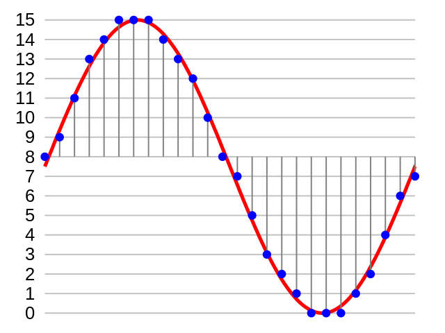
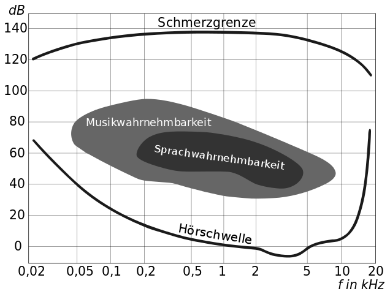

# Technische Hintergründe

## SD-Karte

## Audioausgabe

### Puls-Code-Modulation

Um Schall digital zu speichern, muss ein analoges elektrisches Signal (welches vom Mikrofon aus den Schallwellen erzeugt wird) digitalisiert werden, d.h. in eine Folge von Bits (oder Bytes) umgewandelt werden.

Die Puls-Code-Modulation (PCM) macht genau das. Mit einem konstanten zeitlichen Abstand wird die Amplitude des Signals gemessen und durch eine Zahl in einem bestimmten Bereich codiert. Dieser Zahlenbereich wird in Bit angegeben. Je mehr Bit pro Abtastung (*Sample*) zu Verfügung stehen, desto besser ist die Qualität der digitalisierten Daten.

In folgendem Beispiel wird eine Sinuswelle durch die Zahlen 0 bis 15, also mit 4 Bit codiert:

Das codierte Signal sieht also folgendermassen aus:

8, 9, 11, 13, 14, 15, 15, 15, 14, 13, 12, 10, 8, 7, 5, 3, 2, 1, 0, 0, 0, 1, 2, 4, 6, 7

Damit die Zahlenfolge wieder in ein Audiosignal umgewandelt werden kann, müssen auch die Anzahl Bit pro Abtastung sowie die *Abtastrate* bekannt sein.

#### Abtastrate

Die Frequenz, mit welcher das Signal gemessen wird, heisst *Abtastrate*. Sie muss gemäss dem [Nyquist-Shannon-Abtasttheorem](https://de.wikipedia.org/wiki/Nyquist-Shannon-Abtasttheorem) mindestens doppelt so gross wie die grösste zu codierende Frequenz sein, damit kein Qualitätsverlust auftritt.

Da die Musikwahrnehmbarkeit beim Menschen bis ca. 8 kHz reicht, beträgt die minimale Abstastrate 16 kHz:

#### Abwägungen

Eine hohe Anzahl Bit pro Abtastung und eine hohe Abtastrate führen zu einer besseren Qualität, aber auch zu einer viel grösseren Datenmenge.

Heute werden Audiodaten mit Hilfe von komplexen Algorithmen (z.B. MP3) komprimiert, um die Datenmenge zu reduzieren. Diese Algorithmen benötigen aber eine grosse Rechenleistung, die auf dem Arduino nicht zu Verfügung steht.

### Pulsweitenmodulation

Tbd.

### PWM mit ATmega328

Der ATmega329-Mikrocontroller, welcher im Arduino Duemilanove und Uno verwendet wird, hat drei Timer/Counter, welche für PWM verwendet werden können. Jeder der drei Timer kann auf je zwei digitalen Ausgängen ein PWM-Signal erzeugen. Die folgende Tabelle zeigt, welcher Timer welche Ausgänge ansteuern kann:

| Timer | Output Register | Pin (ATmega) | Pin (Arduino) |
| ----- | --------------- | ------------ | ------------- |
|     0 | OC0A            | PD6          |  6            |
|     0 | OC0B            | PD5          |  5            |
|     1 | OC1A            | PB1          |  9            |
|     1 | OC1B            | PB2          | 10 (SS)       |
|     2 | OC2A            | PB3          | 11 (MOSI)     |
|     3 | OC2B            | PD3          |  3            |

Für das Pinball-Board muss der Arduino-Pin 10 verwendet werden, die Betrachtungen gelten aber grundsätzlich für alle PWM-Ausgänge, obschon es im Detail Abweichungen geben kann.

#### Konfiguration des Zeitmessers/Zählers 1

Die Konfiguration des Zeitmessers/Zählers 1 (*Timer/Counter 1*) findet über die zwei Register TCCR1A (*Timer/Counter 1 Control Register A*) und TCCR1B (*Timer/Counter 1 Control Register B*) statt, welche im folgenden erklärt werden. Die Bedeutung der einzelen Bits der beiden 8-Bit-Register ist in den folgenden Tabellen erklärt:

| TCCR1A Bit | Name   | Bedeutung                                     |
| ---------- | ------ | --------------------------------------------- |
|          7 | COM1A1 | Ausgabe des Timers auf OC1A (Pin 9)           |
|          6 | COM1A0 | Ausgabe des Timers auf OC1A (Pin 9)           |
|          5 | COM1B1 | Ausgabe des Timers auf OC1B (Pin 10)          |
|          4 | COM1B0 | Ausgabe des Timers auf OC1B (Pin 10)          |
|          3 | -      | wird nicht verwendet                          |
|          2 | -      | wird nicht verwendet                          |
|          1 | WGM11  | Wellenform-Modus (*Waveform Generation Mode*) |
|          0 | WGM10  | Wellenform-Modus (*Waveform Generation Mode*) |

| TCCR1B Bit | Name   | Bedeutung                                     |
| ---------- | ------ | --------------------------------------------- |
|          7 | ICNC1  | *Input Capture Noise Canceler*                |
|          6 | ICES1  | *Input Capture Edge Select*                   |
|          5 | -      | wird nicht verwendet                          |
|          4 | WGM13  | Wellenform-Modus (*Waveform Generation Mode*) |
|          3 | WGM12  | Wellenform-Modus (*Waveform Generation Mode*) |
|          2 | CS12   | Taktfrequenz (*Clock Select*)                 |
|          1 | CS11   | Taktfrequenz (*Clock Select*)                 |
|          0 | CS10   | Taktfrequenz (*Clock Select*)                 |

Die Bits ICNC1 und ICES1 beziehen sich auf die Zeitmessung von externen Ereignissen und haben keine Bedeutung für PWM.

Mit den beiden COM1xx-Bits kann festgelegt werden, wie die Ausgabe der Pins 9
und 10 mit dem Zeitmesser verknüpft werden sollen. Über die zwei Bits kann einer der folgenden vier Modi festgelegt werden (dies gilt für alle drei Timer):

| Modus | COMxx1 | COMxx0 | Beschreibung          |
| ----- | ------ | ------ | --------------------- |
|     0 |      0 |      0 | keine Ausgabe auf Pin |
|     1 |      0 |      1 | Wechsle Pin           |
|     2 |      1 |      0 | Setze Pin auf TIEF    |
|     3 |      1 |      1 | Setze Pin auf HOCH    |

Mit dem Modus 0 wird der entsprechende Pin nicht vom Zeitmesser beeinflusst. Mit dem Modus 1 wird die Ausgabe des Pins bei jedem Impuls des Zeitgebers gewechselt (d.h. ein Pin mit HOHER Ausgabe wird auf TIEF gesetzt, ein Pin mit TIEFER Ausgabe auf HOCH). Mit den Modi 2 und 3 wird die Ausgabe der Pins auf TIEF bzw. HOCH gesetzt.

Mit dem Wellenform-Modus kann das Zähl- und Impulsverhalten der Zeitmessers festgelegt werden. Die für PWM relevanten Wellenform-Modi sind in der folgenden Tabelle aufgeführt:

| Modus | WGM13 | WGM12 | WGM11 | WGM10 | Beschreibung                            |
| ----- | ----- | ----- | ----- | ----- | --------------------------------------- |
|     1 |     0 |     0 |     0 |     1 | PWM, Phase Correct, 8-bit               |
|     2 |     0 |     0 |     1 |     0 | PWM, Phase Correct, 9-bit               |
|     3 |     0 |     0 |     1 |     1 | PWM, Phase Correct, 10-bit              |
|     5 |     0 |     1 |     0 |     1 | Fast PWM, 8-bit                         |
|     6 |     0 |     1 |     1 |     0 | Fast PWM, 9-bit                         |
|     7 |     0 |     1 |     1 |     1 | Fast PWM, 10-bit                        |
|     8 |     1 |     0 |     0 |     0 | PWM, Phase and Frequency Correct, ICR1  |
|     9 |     1 |     0 |     0 |     1 | PWM, Phase and Frequency Correct, OCR1A |
|    10 |     1 |     0 |     1 |     0 | PWM, Phase Correct, ICR1                |
|    11 |     1 |     0 |     1 |     1 | PWM, Phase Correct, OCR1A               |
|    14 |     1 |     1 |     1 |     0 | Fast PWM, ICR1                          |
|    15 |     1 |     1 |     1 |     1 | Fast PWM, OCR1A                         |

Tbd.
